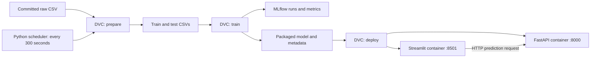

# Penguin Species Classifier — PMLDL Assignment 1

A small automated machine-learning pipeline with all three required stages:
**data engineering → model engineering → deployment**. The model predicts
Adelie, Chinstrap, or Gentoo from four penguin measurements.

The full pipeline runs immediately and every **five minutes** while its scheduler
is running. FastAPI and Streamlit run in **separate Docker containers**.



## Prerequisites

- Python **3.11** and Git.
- Docker Desktop running with **Linux containers**, or Docker Engine with the
  Compose plugin. Verify `docker version` shows a server and `docker compose
  version` succeeds. Compose must support `up --wait` (v2.18+).
- Ports 8000 and 8501 available. Port 5000 is used only for the optional MLflow UI.
- Internet access for the initial Python package installation and Docker image
  builds. Dataset downloads and cloud accounts are not needed at runtime.

Run all commands from the repository root. The first build takes longer because
it downloads packages and images; later builds reuse Docker's dependency layers.

## Quick start — Windows PowerShell

After downloading or cloning this repository:

```powershell
py -3.11 -m venv .venv
.\.venv\Scripts\python.exe -m pip install -r requirements.txt
.\.venv\Scripts\python.exe pipeline.py --once
```

Virtual-environment activation is optional. These explicit commands avoid
PowerShell execution-policy issues and use the correct Python for all DVC stages.
On an already configured copy, start with the last command.

Open:

- **Web application:** http://localhost:8501
- **API documentation:** http://localhost:8000/docs
- **API health and loaded model run ID:** http://localhost:8000/health

The app's default measurements should predict **Adelie**. Press **Predict species**
to call the API and display the species and the model's MLflow run ID.

## Quick start — Linux/macOS

```bash
python3.11 -m venv .venv
.venv/bin/python -m pip install -r requirements.txt
.venv/bin/python pipeline.py --once
```

The pipeline uses portable Python subprocess calls rather than shell-specific
scripts. Docker must be available to the current user.

## Run automatically every five minutes

```powershell
.\.venv\Scripts\python.exe pipeline.py --interval-seconds 300
```

The first run starts immediately. Subsequent starts follow five-minute ticks,
measured from scheduler startup. Each run executes:

```text
dvc repro --force --no-run-cache
```

Both flags are intentional: preparation, training, and deployment run again even
when the input data has not changed. Docker builds both images and recreates both
containers; the new API image contains the freshly trained model and metadata.
Deployment verifies that `/health` and `/predict` report the new run ID.

Keep the terminal open and the computer awake. This is a foreground scheduler,
not a Windows service. A file lock prevents another `pipeline.py` process from
starting in the same repository. Runs are sequential; missed ticks are skipped
instead of overlapping. A failure is logged, and the scheduler retries on the
next tick. A failed preparation or training stage prevents deployment.

If runs consistently exceed five minutes, increase the interval, for example
`--interval-seconds 600`, as permitted by the assignment. The scheduler reports
overruns. Brief API unavailability during container replacement is expected.

For a bounded demonstration of two real five-minute runs:

```powershell
.\.venv\Scripts\python.exe pipeline.py --interval-seconds 300 --max-runs 2
```

The scheduler writes detailed output to `.runtime/pipeline.log` and per-run start,
finish, duration, status, and successful model run IDs to `.runtime/runs.jsonl`.
The latest verified deployment is recorded in `.runtime/deployment.json`.
Use `--once` when a nonzero process exit code is needed to detect failure.

## Pipeline stages

### 1. Data engineering

`prepare` loads the committed `data/raw/penguins.csv`, validates its columns,
converts measurements to numeric values, and removes incomplete rows, invalid
nonpositive/nonfinite measurements, and duplicate feature/label rows. It uses:

| Field | Meaning |
|---|---|
| `bill_length_mm` | Bill length in millimetres |
| `bill_depth_mm` | Bill depth in millimetres |
| `flipper_length_mm` | Flipper length in millimetres |
| `body_mass_g` | Body mass in grams |
| `species` | Target label: Adelie, Chinstrap, or Gentoo |

It creates a stratified 80/20 train/test split with seed 42. The training split
is filtered using per-feature fences `[Q1 − 1.5×IQR, Q3 + 1.5×IQR]`. These fences
are learned only from training data; the test set is not filtered using learned
statistics. This avoids leaking test information into preparation or producing
an artificially easy holdout. No outliers are invented if the rule detects zero.

Outputs are `train.csv`, `test.csv`, and `cleaning_report.json` in `data/processed`.
The CSVs preserve source row IDs to verify that train and test are disjoint.
The report records cleaning counts, split sizes, class counts, and outlier bounds.
Neither the row ID nor the unused island, sex, or year columns is a model feature.

### 2. Model engineering

`train` fits one scikit-learn `Pipeline` containing `StandardScaler` and
`LogisticRegression(max_iter=1000, random_state=42)`. Scaling is fitted on
training features only. It computes held-out accuracy and macro-F1 and logs
parameters, metrics, the cleaning report, and an MLflow model with an input example
and signature to the `penguin-species` experiment.

Outputs in `models`:

- `model.joblib`: the complete fitted scaler and classifier.
- `metrics.json`: test accuracy and macro-F1.
- `metadata.json`: MLflow run ID, feature names, class names, training time,
  scikit-learn version, and model checksum.

MLflow metadata is stored in `.runtime/mlflow/mlflow.db` (SQLite), with artifacts
in `.runtime/mlflow/artifacts`. An always-running tracking server is unnecessary.
To inspect runs in a separate terminal:

```powershell
.\.venv\Scripts\mlflow.exe ui --backend-store-uri sqlite:///.runtime/mlflow/mlflow.db --host 127.0.0.1 --port 5000
```

On Linux/macOS replace the executable with `.venv/bin/mlflow`. Open
http://localhost:5000 and select **penguin-species**. Training and serving share
the exact versions in `requirements-model.txt`.

### 3. Deployment

`deploy` uses `code/deployment/docker-compose.yml` to build and recreate the `api`
and `app` services, wait for health checks, and make a real prediction request.
The API image embeds the model, so training a replacement cannot change the
currently running service's model halfway through a request.

The app waits for API readiness and calls `http://api:8000/predict` over the
Compose network. Host ports bind to localhost. Both services restart with Docker
unless explicitly stopped. Retraining still requires the Python scheduler.

The API validates four required positive, finite measurements. Missing/invalid
fields return HTTP 422. It checks feature names, scikit-learn version, class
labels, and model checksum on startup; a missing or mismatched model fails startup.

Example request from PowerShell:

```powershell
$sample = @{ bill_length_mm = 39.1; bill_depth_mm = 18.7; flipper_length_mm = 181; body_mass_g = 3750 } | ConvertTo-Json
Invoke-RestMethod -Method Post -Uri http://localhost:8000/predict -ContentType application/json -Body $sample
```

Example response:

```json
{"species": "Adelie", "run_id": "<MLflow run ID of the deployed model>"}
```

The Streamlit app contains four inputs, a prediction button, the prediction, and
the run ID. Requests time out after ten seconds, and service errors are displayed
as readable messages.

## Repository structure

```text
code/
  datasets/prepare.py
  models/train.py
  deployment/
    api/                 # FastAPI, Dockerfile, serving dependencies
    app/                 # Streamlit, Dockerfile, UI dependencies
    deploy.py
    docker-compose.yml
data/
  raw/                   # Committed source CSV and attribution
  processed/             # Generated split CSVs and cleaning report
models/                  # Generated model, metadata, and metrics
tests/                   # Data, model, API, app, scheduler, and DVC failure tests
docs/                    # Verification evidence
.dvc/                    # DVC configuration; local cache is ignored
dvc.yaml                 # Three connected stages
dvc.lock                 # Hashes recorded by the latest successful reproduction
pipeline.py              # One-time runner and five-minute scheduler
penguins.py              # Shared feature contract
requirements.txt         # Pinned direct development/training dependencies
requirements-model.txt   # Identical model dependencies on host and in API
```

Raw data is tracked directly in Git because it is small. Processed data, models,
virtual environments, logs, MLflow databases, and DVC caches are generated and
ignored by Git. No DVC remote or `dvc pull` is required: a fresh clone regenerates
everything with `pipeline.py --once`. DVC's tracked configuration is already
initialized; do not rerun `dvc init` in a clone. Scheduled runs may update
`dvc.lock`; scheduling never creates Git commits or pushes anything.

## Tests and TA demonstration

```powershell
.\.venv\Scripts\python.exe -m pytest -q
docker compose -f code/deployment/docker-compose.yml ps
```

Tests cover real preparation and training, train-only scaling, saved model and
MLflow prediction equivalence, input validation, UI success/error messages,
scheduler retries and overruns, and an isolated DVC run where training fails and
deployment is never called. Tests do not start or modify Docker containers.
Only test fixtures contain synthetic malformed rows.

Suggested demonstration:

1. Show the three stages in `dvc.yaml` and the committed raw CSV.
2. Start the bounded two-run scheduler shown above.
3. Show the split files, cleaning report, metrics, and MLflow run.
4. Show two healthy containers with Compose and predict through the web app.
5. After the second scheduled run, predict again and show the new run ID in the
   app/API, matching the second successful entry in `.runtime/runs.jsonl`.

| Assignment criterion | Evidence |
|---|---|
| Data engineering | Cleaning report and saved train/test CSVs |
| Model engineering | Packaged pipeline, metrics JSON, MLflow experiment |
| Deployment | Separate healthy API/app containers and browser prediction |
| Automation | Two full scheduled runs with timestamps and changed run IDs |
| Repository structure | Organized source, dependency files, DVC graph, README |

## Stop and troubleshoot

Press **Ctrl+C** in the scheduler terminal to stop future runs. Containers remain
available. To stop and remove this project's containers and network:

```powershell
docker compose -f code/deployment/docker-compose.yml down
```

Useful diagnostics:

```powershell
docker version
docker compose -f code/deployment/docker-compose.yml ps
docker compose -f code/deployment/docker-compose.yml logs --tail 80 api app
Get-Content .runtime/pipeline.log -Tail 80
```

- **Docker connection fails:** start Docker Desktop, select Linux containers,
  and wait until `docker version` shows a server.
- **Port already allocated:** stop the conflicting local service before retrying.
- **Model missing on direct Compose startup:** run `pipeline.py --once` first;
  building the API requires Stage 2's artifacts.
- **App reports unavailable:** wait for deployment to finish, then retry; check
  API health and container logs if the problem persists.
- **Another pipeline is running:** stop its scheduler before starting a second
  one. The lock is released when the owning process exits.
- **Later stage fails:** inspect the log and rerun `pipeline.py --once` after
  fixing it. Earlier-stage failures do not redeploy the service. There is no
  automatic rollback if a replacement container itself fails to start.

## Dataset and submission

Source, CC0 license, checksum, and research citation are documented in
[data/raw/README.md](data/raw/README.md). The excluded CelebFaces and patient's
smoking status datasets are not used.

The solution is prepared locally. To submit, create your own **public GitHub
repository**, commit the source/configuration/raw data/README and `dvc.lock`, push,
and submit that repository's URL. Do not commit `.venv`, `.runtime`, or caches.
No cloud deployment is required for the local TA demonstration.
